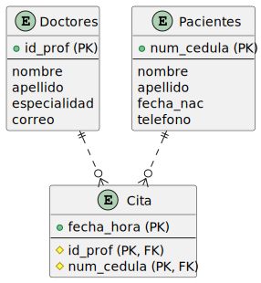
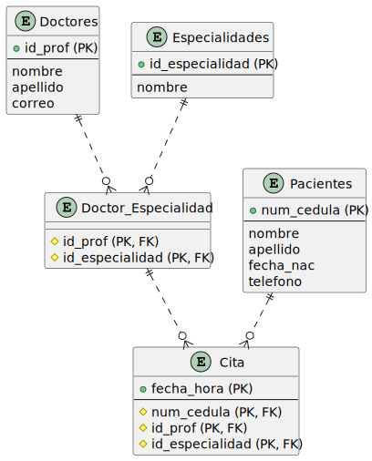
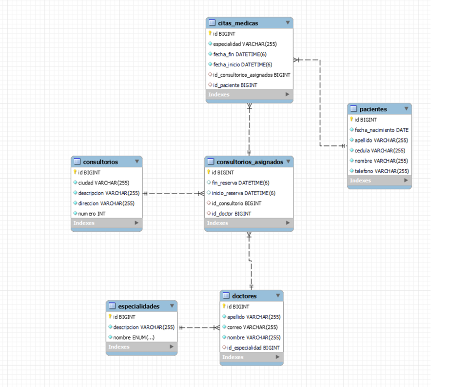

# Citas básico

## Enunciado

Tenemos que diseñar una base de datos sobre citas médicas y disponemos de la siguiente información:

- Se desea almacenar la información básica de los doctores: nombre, apellido, especialidad, correo.
- Se necesita almacenar la información de los pacientes: nombre, apellido, fecha de nacimiento, telefono.
- Se necesita almacenar la información de las citas: fecha y hora, doctor, paciente.
- Las opciones de especialidades son: Medicina general, Cardiología, Medicina interna, Dermatología, Rehabilitación física, Psicología, Odontología, Radiología.

## Modelo Entidad-Relación

<!--
```  
@startuml diagrama-er.svg
entity "Doctores" as doctores {
  + id_prof (PK)
  --
  nombre
  apellido
  especialidad
  correo
}

entity "Pacientes" as pacientes {
  + num_cedula (PK)
  --
  nombre
  apellido
  fecha_nac
  telefono
}

entity "Cita" as cita {
  + fecha_hora (PK)
  --
  # id_prof (PK, FK)
  # num_cedula (PK, FK)
}

doctores ||..o{ cita
pacientes ||..o{ cita
@enduml
```

```
@startuml diagrama-er-e.svg
entity "Doctores" as doctores {
  + id_prof (PK)
  --
  nombre
  apellido
  correo
}

entity "Pacientes" as pacientes {
  + num_cedula (PK)
  --
  nombre
  apellido
  fecha_nac
  telefono
}

entity "Cita" as cita {
  + fecha_hora (PK)
  --
  # num_cedula (PK, FK)
  # id_prof (PK, FK)
  # id_especialidad (PK, FK)
}

entity "Especialidades" as especialidades {
  + id_especialidad (PK)
  --
  nombre
}

entity "Doctor_Especialidad" as doctor_especialidad {
  # id_prof (PK, FK)
  # id_especialidad (PK, FK)
}

pacientes ||..o{ cita
doctores ||..o{ doctor_especialidad
especialidades ||..o{ doctor_especialidad
doctor_especialidad ||..o{ cita
@enduml
```
-->

***Diagramas creados con [plantuml](https://plantuml.com)***

Diagrama para doctores, pacientes y citas.



Diagrama mejorado para la necesidad de varias especialidades para cada doctor.



Diagrama avanzado que considera aspectos como consultorio, ubicaciones, asignación de consultorio, etc.



## Modelo Relacional

Modelo relacional para caso básico sin múltiples especialidades ni consultorios. 

- **Doctores** = (**id_prof**, nombre, apellido, especialidad, correo)
- **Pacientes** = (**num_cedula**, nombre, apellido, fecha_nac, telefono)
- **Cita** = (**fecha_hora**, ***id_prof***, ***num_cedula***)

Modelo relacional para caso en el que se emplea múltiples especialiades para un mismo doctor.

- **Doctores** = (**id_prof**, nombre, apellido, correo)
- **Pacientes** = (**num_cedula**, nombre, apellido, fecha_nac, telefono)
- **Cita** = (**fecha_hora**, ***id_prof***, ***num_cedula***, ***id_especialidad***)
- **Especialidades** = (**id_especialidad**, nombre)
- **Doctor_Especialidad** = (***id_prof***, ***id_especialidad***)

## SQL -- MySQL

**Abra el archivo [`citas-basico.sql`](citas-basico.sql) para la creación de la base de datos a través de DDL**

Use el ejemplo de [proveedores](https://github.com/norbeydanilo/database-exercises/tree/main/proveedores-intro) para la creación, modificación, eliminación, consultas a través de DML.

> Create by Norbey Danilo Muñoz Cañón, 2023.
>
> The idea of ​​intellectual property is fundamentally wrong. Knowledge belongs to all people!