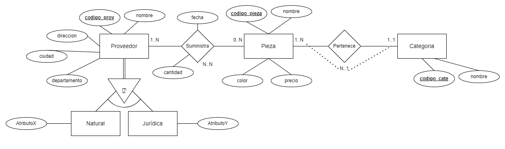

# Proveedores

## Enunciado

Tenemos que diseñar una base de datos sobre proveedores y disponemos de la siguiente información:

- De cada proveedor conocemos su nombre, dirección, ciudad, departamento y un código de proveedor que será único para cada uno de ellos.
- Nos interesa llevar un control de las piezas que nos suministra cada proveedor. Es importante conocer la cantidad de las diferentes piezas que nos suministra y en qué fecha lo hace. Tenga en cuenta que un mismo proveedor nos puede suministrar una pieza con el mismo código en diferentes fechas. El diseño de la base de datos debe permitir almacenar un histórico con todas las fechas y las cantidades que nos ha proporcionado un proveedor.
- Una misma pieza puede ser suministrada por diferentes proveedores.
- De cada pieza conocemos un código que será único, nombre, color, precio y categoría.
- Pueden existir varias categorías y para cada categoría hay un nombre y un código de categoría único.
- Una pieza sólo puede pertenecer a una categoría.

## Modelo Entidad-Relación



## Modelo Relacional

### Opción 1

- **Proveedor** = (<u>**codigo_prov**</u>, nombre, direccion, ciudad, departamento, tipo)

- **Pieza** = (<u>**codigo_pieza**</u>, nombre, color, precio, ***codigo_cate***)

- **Categoria** = (<u>**codigo_cate**</u>, nombre)

- **Suministra** = (<u>***codigo_prov***</u>, <u>***codigo_pieza***</u>, <u>**fecha_hora**</u>, cantidad)

- **Natural** = (<u>***codigo_prov***</u>, AtributoX)

- **Juridica** = (<u>***codigo_prov***</u>, AtributoY)

### Opcion 2

- **Pieza** = (<u>**codigo_pieza**</u>, nombre, color, precio, ***codigo_cate***)

- **Categoria** = (<u>**codigo_cate**</u>, nombre)

- **Suministra** = (<u>***id_prov***</u>, <u>***codigo_pieza***</u>, <u>**fecha_hora**</u>, cantidad)

- **Natural** = (<u>**id_prov**</u>, nombre, direccion, ciudad, departamento, AtributoX)

- **Juridica** = (<u>**id_prov**</u>, nombre, direccion, ciudad, departamento, AtributoY)

## SQL -- MySQL

### DDL para crear la base de datos

**Usando DDL defina la estructura de datos. Ejecute el fichero [`proveedores.sql`](proveedores.sql) en la shell de MySQL.**

**Para su entendimiento puede seguir las instrucciones y pasos a continuación:**

Eliminar la base de datos 'proveedores' si existe

```sql
DROP DATABASE IF EXISTS proveedores;
```

Crear la base de datos 'proveedores'

```sql
CREATE DATABASE IF NOT EXISTS proveedores CHARACTER SET utf8mb4;
```

Seleccionar la base de datos 'proveedores' para usarla

```sql
USE proveedores;
```

Crea la tabla 'categoria' con los campos 'cod_categoria' y 'nombre'

```sql
CREATE TABLE
    categoria (
        cod_categoria INT NOT NULL,
        nombre VARCHAR(20) NOT NULL,
        PRIMARY KEY (cod_categoria)
    );
```

Crea la tabla 'pieza' con los campos 'cod_pieza', 'nombre', 'color', 'precio' y 'cod_categoria'

```sql
CREATE TABLE
    pieza (
        cod_pieza INT NOT NULL,
        nombre VARCHAR(20) NOT NULL,
        color VARCHAR(15) NOT NULL,
        precio DECIMAL(10, 2) NOT NULL CHECK (precio > 0),
        cod_categoria INT NOT NULL,
        PRIMARY KEY (cod_pieza),
        FOREIGN KEY (cod_categoria) REFERENCES categoria(cod_categoria) ON DELETE CASCADE
    );
```

La cláusula `ON DELETE CASCADE` en SQL se utiliza para especificar que cuando un registro en la tabla principal (en este caso, `categoria`) es eliminado, también se deben eliminar automáticamente todos los registros correspondientes en la tabla secundaria (en este caso, `pieza`) que hacen referencia al registro eliminado.

En otras palabras, si tienes una categoría específica que se elimina de la tabla `categoria`, todos las piezas que pertenecen a esa categoría también se eliminarán de la tabla `pieza`. Esto ayuda a mantener la integridad de los datos en la base de datos.

En SQL, además de `ON DELETE CASCADE`, existen otras opciones que puedes usar para definir el comportamiento de las claves foráneas cuando se elimina un registro en la tabla principal:

1. `ON DELETE SET NULL`: Si se elimina un registro en la tabla principal, todos los registros correspondientes en la tabla secundaria que hacen referencia al registro eliminado se establecerán en NULL.

2. `ON DELETE NO ACTION` o `ON DELETE RESTRICT`: Estas son las opciones predeterminadas. Si intentas eliminar un registro en la tabla principal que tiene registros correspondientes en la tabla secundaria, la base de datos no permitirá la operación y generará un error.

3. `ON DELETE SET DEFAULT`: Si se elimina un registro en la tabla principal, todos los registros correspondientes en la tabla secundaria que hacen referencia al registro eliminado se establecerán en su valor predeterminado. Sin embargo, esta opción no es tan comúnmente utilizada y no está disponible en todos los sistemas de gestión de bases de datos.

Crea la tabla 'proveedor' con los campos 'cod_prov', 'nombre', 'direccion', 'ciudad', 'departamento' y 'tipo'

```sql
CREATE TABLE
    proveedor (
        cod_prov INT NOT NULL,
        nombre VARCHAR(20) NOT NULL,
        direccion VARCHAR(40) NOT NULL,
        ciudad VARCHAR(30) NOT NULL,
        departamento VARCHAR(20) NOT NULL,
        tipo ENUM ('Natural', 'Jurídica') NOT NULL,
        PRIMARY KEY (cod_prov)
    );
```

`ENUM` es un tipo de dato en SQL que permite especificar un conjunto fijo de valores predefinidos aceptados para un campo en particular. En este caso, `ENUM ('Natural', 'Jurídica')` significa que el campo `tipo` solo puede tomar los valores 'Natural' o 'Jurídica'. Si intentamos insertar un valor diferente a estos, la base de datos generará un error.

Además, `NOT NULL` significa que el campo `tipo` debe tener un valor en cada registro; no puede ser dejado en blanco.

Por lo tanto, al definir `tipo ENUM ('Natural', 'Jurídica') NOT NULL`, estamos asegurando que cada proveedor en la tabla `proveedor` debe ser clasificado como 'Natural' o 'Jurídica', y no puede ser dejado sin clasificar.

Crea la tabla 'pnatural' con los campos 'cod_prov' y 'atributo_x'

```sql
CREATE TABLE
    pnatural (
        cod_prov INT NOT NULL,
        atributo_x VARCHAR(10) NOT NULL,
        PRIMARY KEY (cod_prov),
        FOREIGN KEY (cod_prov) REFERENCES proveedor(cod_prov) ON DELETE CASCADE
    );
```

Crea la tabla 'pjuridica' con los campos 'cod_prov' y 'atributo_y'

```sql
CREATE TABLE
    pjuridica (
        cod_prov INT NOT NULL,
        atributo_y VARCHAR(10) NOT NULL,
        PRIMARY KEY (cod_prov),
        FOREIGN KEY (cod_prov) REFERENCES proveedor(cod_prov) ON DELETE CASCADE
    );
```

Crea la tabla 'suministra' con los campos 'cod_prov', 'cod_pieza', 'fecha_hora' y 'cantidad'

```sql
CREATE TABLE
    suministra (
        cod_prov INT NOT NULL,
        cod_pieza INT NOT NULL,
        fecha_hora DATETIME(6) NOT NULL, -- hasta microsegundos
        cantidad INT NOT NULL CHECK (cantidad > 0),
        FOREIGN KEY (cod_prov) REFERENCES proveedor(cod_prov) ON DELETE CASCADE,
        FOREIGN KEY (cod_pieza) REFERENCES pieza(cod_pieza) ON DELETE CASCADE,
        PRIMARY KEY (
            cod_prov,
            cod_pieza,
            fecha_hora
        )
    );
```

### DML para Insertar

**Usando DML para insertar datos. Ejecute el fichero [`in-proveedores.sql`](op-proveedores.sql) en la shell de MySQL para insertar datos en las tablas.**

Formas de insertar:

```sql
INSERT INTO proveedor
VALUES (
        123,
        'Proveedor-1',
        'DirProv-1',
        'Ciudad-A',
        'Depto-D',
        'Natural'
    );

INSERT INTO proveedor
VALUES (
        345,
        'Proveedor-2',
        'DirProv-2',
        'Ciudad-A',
        'Depto-S',
        'Natural'
    );
```

O de la forma:

```sql
INSERT INTO
    proveedor (
        cod_prov,
        nombre,
        direccion,
        ciudad,
        departamento,
        tipo
    )
VALUES (
        123,
        'Proveedor-1',
        'DirProv-1',
        'Ciudad-A',
        'Depto-D',
        'Natural'
    ), (
        345,
        'Proveedor-2',
        'DirProv-2',
        'Ciudad-A',
        'Depto-S',
        'Natural'
    );
```

### DML para Actualizar

**Usando DML para actualizar datos. Ejecute el fichero [`up-proveedor.sql`](up-proveedor.sql) en la shell de MySQL para actualizar datos en las tablas.**

### DML para Eliminar

**Usando DML para eliminar datos. Ejecute el fichero [`del-proveedor.sql`](del-proveedor.sql) en la shell de MySQL para eliminar datos en las tablas.**

### Algebra Relacional -- Consultas